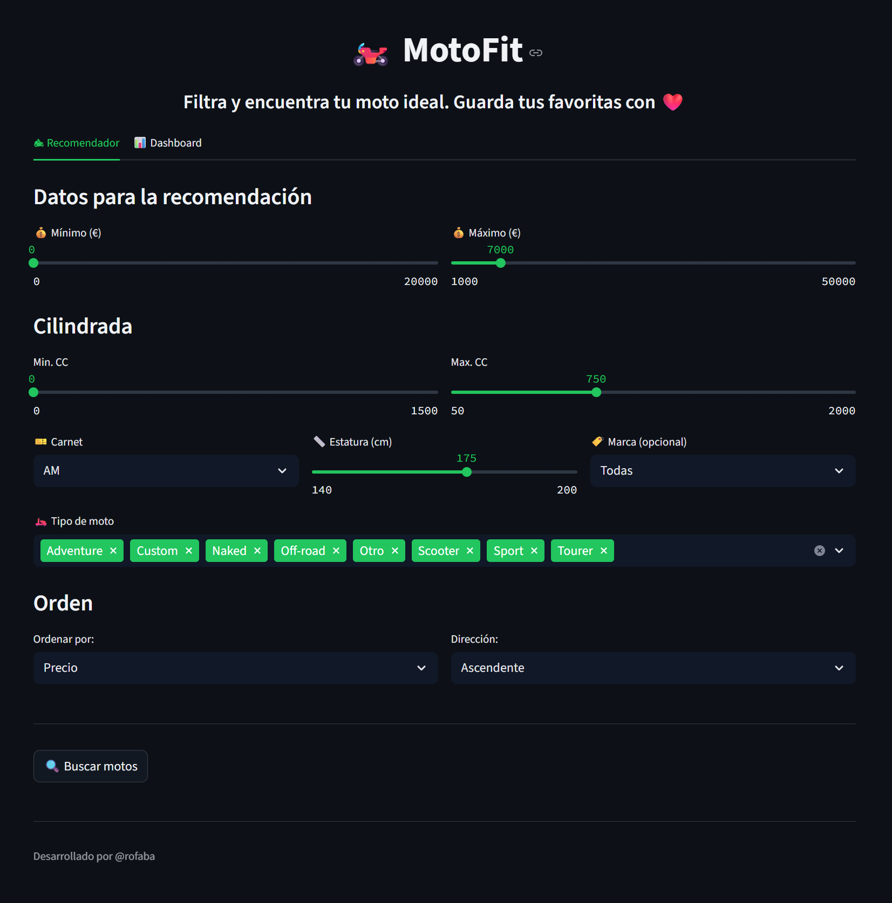
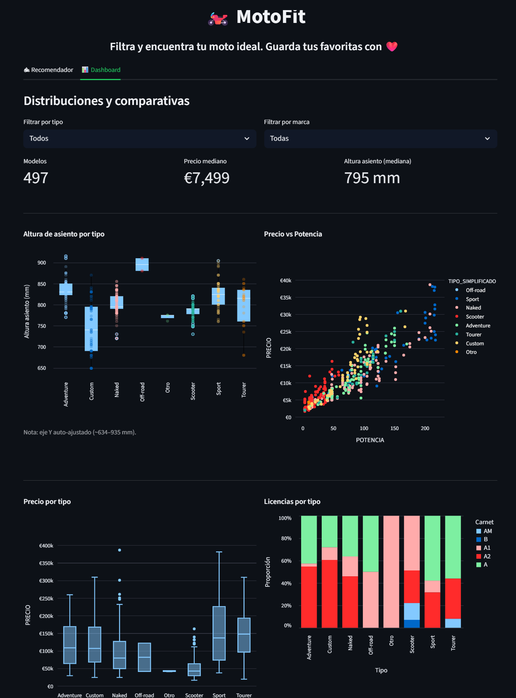

# 🏍️ MotoFit – Buscador y Recomendador de Motos

[](https://www.python.org/)
[](https://streamlit.io/)
[](https://creativecommons.org/licenses/by-nc/4.0/)

**MotoFit** es una aplicación web interactiva, construida con **Python** y **Streamlit**, diseñada para ayudarte a encontrar tu moto ideal. Permite a los usuarios filtrar y explorar el mercado de motos según criterios personales como presupuesto, altura, tipo de licencia y preferencias de marca.

También incluye un panel de control (_Dashboard_) con visualizaciones dinámicas para analizar las principales tendencias del mercado de motocicletas.



***

## 🚀 Características Principales

* **Búsqueda y Filtrado**: Filtra el mercado por un amplio rango de criterios como precio, cilindrada, altura del asiento, tipo de carnet, marca y tipo de moto.
* **Sistema de Favoritos**: Guarda tus motos preferidas en una lista que persiste durante la sesión para una comparación rápida.
* **Visualizaciones Interactivas**: Un _Dashboard_ interactivo con gráficos dinámicos que muestran la distribución de alturas, la relación precio-potencia y otros datos clave del mercado.
* **Modo Oscuro/Claro**: La interfaz se adapta automáticamente a las preferencias de tu sistema operativo.
* **Gestión de Datos Flexible**: Configurado para usar un dataset de demostración local o conectarse a un dataset privado en la nube a través de Streamlit Secrets.

***

## ⚙️ Estructura del Proyecto

```bash
MotoFit/
├── .streamlit/
│   └── secrets.toml             
│
├── data/
│   └── motofit_demo.csv         # Dataset de demostración para uso público
│
├── assets/
│   ├── demo_screenshot.png      
│   └── logos/
│       └── <marcas>.png         
│
├── src/
│   ├── data_preprocessing.py    # Lógica de carga y limpieza de datos
│   ├── recommender_logic.py     # Lógica de filtrado y recomendación
│   └── utils.py                 # Funciones auxiliares (tarjetas, etc.)
│
├── app.py                       
├── requirements.txt             
└── README.md                    
🏁 Instalación y Uso Local
Clona el repositorio:

Bash

git clone [https://github.rofaba/motofit-public.git](https://github.rofaba/motofit-public.git)
cd motofit-public
Crea un entorno virtual e instala las dependencias:

Bash

python -m venv venv
source venv/bin/activate    # Linux / macOS
venv\Scripts\activate       # Windows
pip install -r requirements.txt
Ejecuta la aplicación:

Bash

streamlit run app.py
Abre tu navegador y ve a http://localhost:8501.

📝 Dataset
El dataset de demostración (data/motofit_demo.csv) incluye información clave sobre cada moto, como marca, modelo, precio, potencia, altura del asiento y licencia requerida. El dataset completo utilizado para la versión de producción es privado y no está incluido en este repositorio.

🛠 Tecnologías Utilizadas
Python 3.10+

Streamlit

Pandas

Altair

Plotly Express

📄 Licencia
Este proyecto está bajo la Licencia Creative Commons Attribution-NonCommercial 4.0 International (CC BY-NC 4.0). No se permite el uso comercial del mismo.

🧑‍💻 Autor
Rodrigo Faure

LinkedIn: [https://www.linkedin.com/in/rodrigo-faure-46376266/]

GitHub: [https://github.com/rofaba]

💡 Ideas Futuras
Ampliar y mejorar el dataset, utilizando otras características adicionales

Implementar un sistema de recomendación basado en Machine Learning.

Mejorar la compatibilidad y el diseño para dispositivos móviles.

Añadir soporte para múltiples idiomas.
